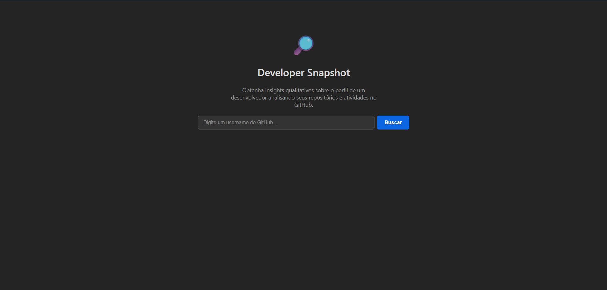
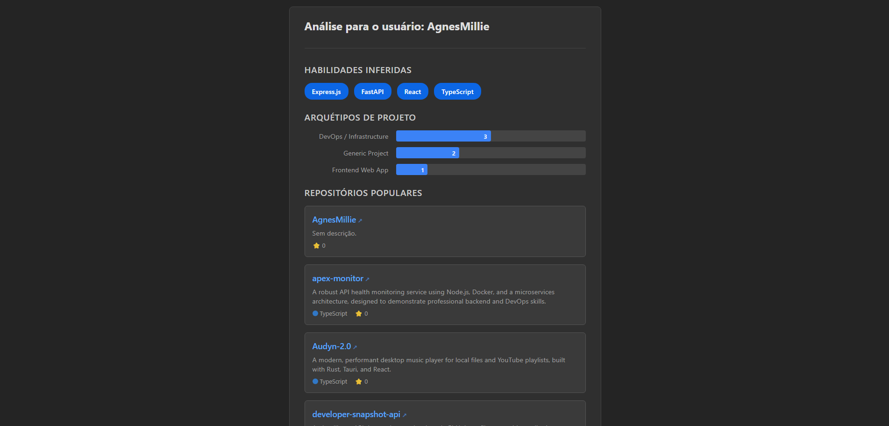

# Developer Snapshot API & Frontend


A full-stack application designed to provide intelligent, qualitative insights into a developer's profile by analyzing their GitHub repositories and activities. This project serves as a comprehensive demonstration of modern software architecture, from a containerized backend to a reactive frontend.

---

### Welcome Screen


### Analysis Results


---

## Core Concept

Standard GitHub profiles show quantitative data (e.g., contribution counts) but often fail to tell the qualitative story of a developer's skills and style. This project bridges that gap by programmatically analyzing a user's public work to infer skills, classify project types, and provide a richer, more nuanced "snapshot".

## Key Features

-   **Intelligent Skill Inference:** Parses dependency files (`requirements.txt`, `package.json`, `pom.xml`) within repositories to identify and list specific frameworks and libraries.
-   **Project Archetype Classification:** Applies a heuristic-based engine to categorize repositories into types like "Frontend Web App," "DevOps / Infrastructure," or "Data Science."
-   **Performant Orchestration:** The backend leverages `asyncio` to perform dozens of concurrent API calls to GitHub, gathering file trees and content in parallel for a responsive experience.
-   **Modern Full-Stack Environment:**
    -   **Backend:** A robust, asynchronous API built with **Python** and **FastAPI**.
    -   **Frontend:** A clean, reactive UI built with **TypeScript** and **React (Vite)**.
    -   **Unified Development:** The entire application is orchestrated with **Docker Compose**, allowing the full-stack environment to be launched with a single `docker-compose up` command.

## API Usage Example

The frontend is powered by the `GET /v1/users/{username}/snapshot` endpoint.

**Example Request:**
```bash
curl http://localhost:8000/v1/users/AgnesMillie/snapshot